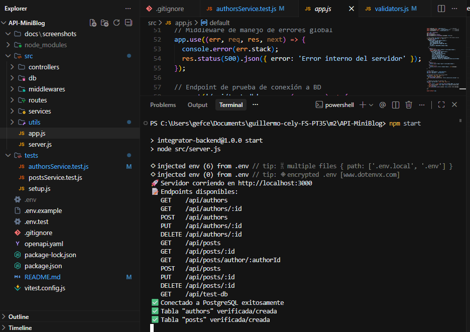
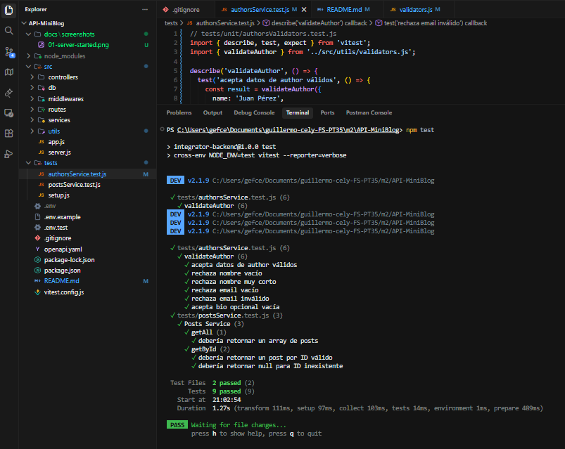
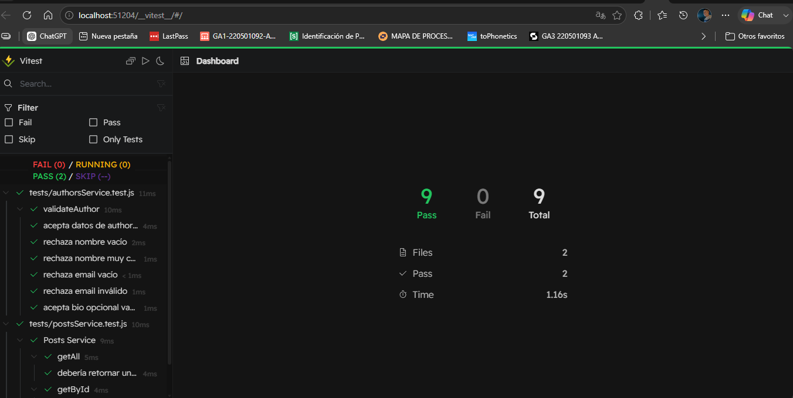
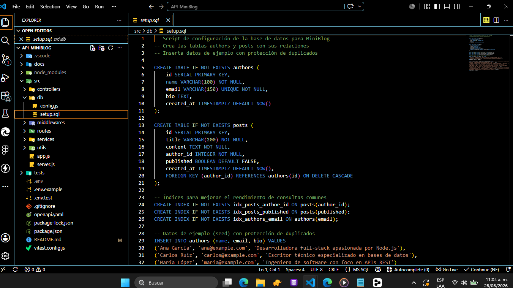
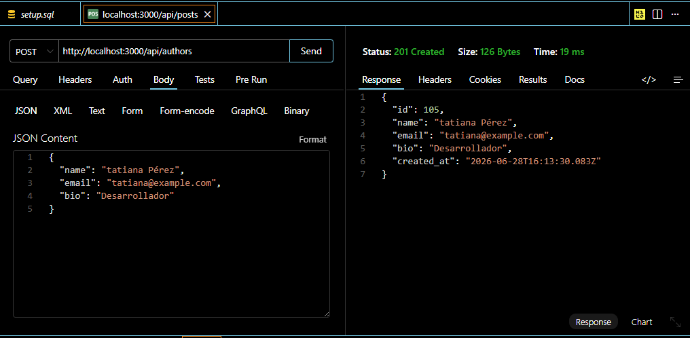
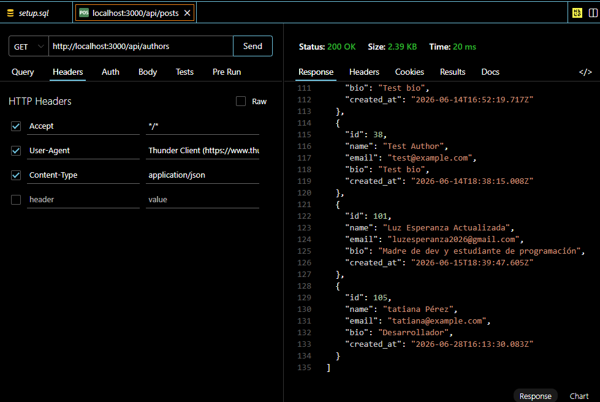
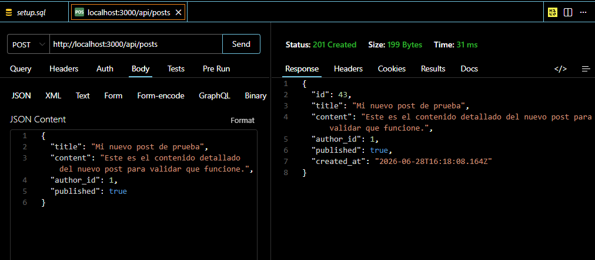
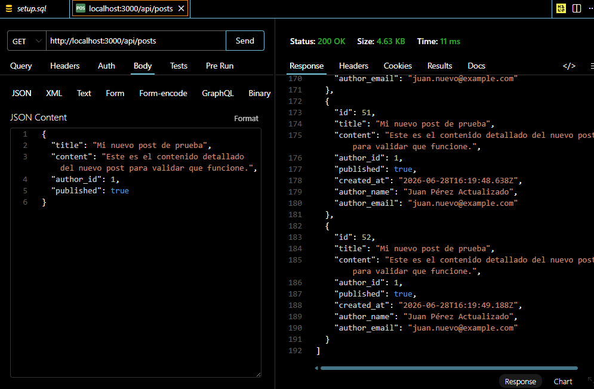

# MiniBlog API - Proyecto Integrador M2


## 📖 Introducción

**MiniBlog API** es una API REST construida con Node.js, Express y PostgreSQL que permite realizar operaciones CRUD sobre las entidades `authors` y `posts`. La API está diseñada para ser simple, escalable y fácil de integrar con frontends.

### ¿Por qué usar esta API?

- ✅ **Arquitectura modular**: Organización clara con separación de responsabilidades
- ✅ **Testing completo**: Suite de pruebas unitarias e integración con Vitest
- ✅ **Validaciones robustas**: Validación de datos en múltiples capas
- ✅ **Base de datos relacional**: PostgreSQL con relaciones y restricciones
- ✅ **Documentación clara**: Endpoints bien documentados y fáciles de usar
- ✅ **ES Modules**: Código moderno con sintaxis ES6+

## 🚀 Tecnologías Utilizadas

### Backend Framework
- **Node.js 18+**: Runtime JavaScript
- **Express 5.2.1**: Framework web minimalista y flexible

### Base de Datos
- **PostgreSQL 18.x**: Base de datos relacional robusta
- **pg 8.21.0**: Cliente de PostgreSQL para Node.js

### Testing
- **Vitest 2.1.9**: Framework de testing moderno y rápido
- **Supertest 7.2.2**: Testing de endpoints HTTP
- **@vitest/ui 2.1.8**: Interfaz visual para Vitest

### Herramientas de Desarrollo
- **ES Modules**: Sistema de módulos nativo de JavaScript
- **dotenv 17.4.2**: Gestión de variables de entorno
- **cors 2.8.6**: Middleware para CORS
- **body-parser 2.2.2**: Middleware para parsing de JSON
- **cross-env 7.0.3**: Variables de entorno multiplataforma

## 📁 Estructura del Proyecto

```
API-MiniBlog/
├── src/
│   ├── app.js                 # Configuración principal de Express
│   ├── server.js              # Punto de entrada del servidor
│   ├── controllers/           # Controladores (preparado para expansión)
│   ├── db/
│   │   ├── config.js          # Configuración de conexión a PostgreSQL
│   │   ├── setup.sql          # Script de creación de tablas
│   │   └── seed.sql           # Datos de ejemplo
│   ├── middlewares/           # Middlewares personalizados
│   ├── routes/
│   │   ├── authors.js         # Rutas para authors
│   │   └── posts.js           # Rutas para posts
│   ├── services/
│   │   ├── authorsService.js  # Lógica de negocio para authors
│   │   └── postsService.js    # Lógica de negocio para posts
│   └── utils/
│       └── validators.js      # Funciones de validación
├── tests/
│   ├── setup.js               # Configuración de tests y mocks
│   ├── authors.test.js        # Tests de integración para authors
│   ├── posts.test.js          # Tests de integración para posts
│   ├── authorsService.test.js # Tests unitarios para authors
│   └── postsService.test.js   # Tests unitarios para posts
├── docs/
│   └── screenshots/           # Capturas de pantalla (Postman, terminal, etc.)
├── .env                       # Variables de entorno (no subido a Git)
├── .gitignore                 # Archivos ignorados por Git
├── package.json               # Dependencias y scripts
├── vitest.config.js           # Configuración de Vitest
└── README.md                 # Documentación del proyecto
```

## 🔧 Instalación

### Requisitos Previos - Descargas Necesarias

Antes de comenzar, descarga e instala las siguientes herramientas:

1. **[Node.js](https://nodejs.org/)** - Runtime JavaScript (versión 18 o superior)
   - Descarga: [https://nodejs.org/](https://nodejs.org/)
   - Verifica instalación: `node --version`

2. **[PostgreSQL](https://www.postgresql.org/download/)** - Base de datos (versión 18 o superior)
   - Descarga: [https://www.postgresql.org/download/](https://www.postgresql.org/download/)
   - En Windows: `& "C:\Program Files\PostgreSQL\18\bin\psql" --version`

3. **[Postman](https://www.postman.com/downloads/)** - Para probar los endpoints de la API
   - Descarga: [https://www.postman.com/downloads/](https://www.postman.com/downloads/)
   - Alternativa: Puedes usar **Thunder Client** (extensión de VS Code) o probar directamente desde el navegador

4. **[Git](https://git-scm.com/downloads)** - Control de versiones
   - Descarga: [https://git-scm.com/downloads](https://git-scm.com/downloads)
   - Verifica instalación: `git --version`

### 1. Clonar el Repositorio

```bash
git clone <url-del-repositorio>
cd API-MiniBlog
```

### 2. Instalar Dependencias

```bash
npm install
```

### 3. Configurar Variables de Entorno

Crear archivo `.env` en la raíz del proyecto:

```env
PORT=3000
DB_HOST=localhost
DB_PORT=5432
DB_USER=postgres
DB_PASSWORD=tu_contraseña
DB_NAME=integrator_db
```

> **⚠️ Importante**: Nunca compartas el archivo `.env` con tus credenciales reales. Agrega `.env` al archivo `.gitignore`.

### 4. Crear la Base de Datos

```bash
createdb integrator_db
```

## ▶️ Ejecución

### Iniciar Servidor

```bash
npm start
```

El servidor se iniciará en `http://localhost:3000`

### Modo Desarrollo con Hot Reload

```bash
npm run dev
```

### Ejecutar Tests

```bash
# Ejecutar todos los tests
npm test

# Ejecutar tests con interfaz visual (abre navegador)
npm run test:ui

# Ejecutar tests con cobertura
npm run test:coverage

# Ejecutar solo tests unitarios
npm run test:unit

# Ejecutar solo tests de integración
npm run test:integration
```

## 📚 Endpoints de la API

### Authors

| Método | Endpoint | Descripción |
|--------|----------|-------------|
| GET | `/api/authors` | Listar todos los autores |
| GET | `/api/authors/:id` | Obtener un autor por ID |
| POST | `/api/authors` | Crear un nuevo autor |
| PUT | `/api/authors/:id` | Actualizar un autor |
| DELETE | `/api/authors/:id` | Eliminar un autor |

### Posts

| Método | Endpoint | Descripción |
|--------|----------|-------------|
| GET | `/api/posts` | Listar todos los posts |
| GET | `/api/posts/:id` | Obtener un post por ID |
| GET | `/api/posts/author/:authorId` | Obtener posts por autor |
| POST | `/api/posts` | Crear un nuevo post |
| PUT | `/api/posts/:id` | Actualizar un post |
| DELETE | `/api/posts/:id` | Eliminar un post |

### Utilidades

| Método | Endpoint | Descripción |
|--------|----------|-------------|
| GET | `/api/test-db` | Probar conexión a la base de datos |

## 📊 Modelo de Datos

### Authors
```javascript
{
  id: Integer (auto-increment),
  name: String (required, max 100),
  email: String (required, unique, max 150),
  bio: String (optional),
  created_at: Timestamp (auto-generated)
}
```

### Posts
```javascript
{
  id: Integer (auto-increment),
  title: String (required, max 200),
  content: String (required),
  author_id: Integer (required, FK → authors.id),
  published: Boolean (default: false),
  created_at: Timestamp (auto-generated)
}
```

## ✅ Validaciones

### Authors
- `name` es obligatorio (mínimo 3 caracteres)
- `email` es obligatorio y debe tener formato válido
- `email` es único en la base de datos

### Posts
- `title` es obligatorio (mínimo 3 caracteres)
- `content` es obligatorio (mínimo 10 caracteres)
- `author_id` es obligatorio y debe existir en authors
- `published` es opcional (default: false)

## 📸 Capturas de Pantalla

### Servidor Iniciado

*Servidor corriendo en http://localhost:3000*
> **Nombre de archivo**: `01-server-started.png`

### Terminal - Tests Exitosos

*Ejecución de tests con Vitest - todos pasando*
> **Nombre de archivo**: `02-tests-passed.png`

### Vitest UI - Interfaz Visual

*Interfaz visual de Vitest para ejecutar y visualizar tests*
> **Nombre de archivo**: `03-vitest-ui.png`

### Estructura del Proyecto en VS Code

*Vista de la estructura de carpetas del proyecto en Visual Studio Code*
> **Nombre de archivo**: `04-vscode-structure.png`

### Postman - Crear Autor

*Endpoint POST /api/authors para crear un nuevo autor*
> **Nombre de archivo**: `05-postman-create-author.png`

### Postman - Listar Autores

*Endpoint GET /api/authors para obtener todos los autores*
> **Nombre de archivo**: `06-postman-list-authors.png`

### Postman - Crear Post

*Endpoint POST /api/posts para crear un nuevo post*
> **Nombre de archivo**: `07-postman-create-post.png`

### Postman - Listar Posts

*Endpoint GET /api/posts para obtener todos los posts*
> **Nombre de archivo**: `08-postman-list-posts.png`

> **Nota**: Agrega las capturas de pantalla en la carpeta `docs/screenshots/` con los nombres de archivo especificados arriba.

## 🧪 Testing

El proyecto incluye una suite completa de pruebas con Vitest:

### Tipos de Tests

- **Tests Unitarios**: Pruebas de servicios y validaciones
  - `authorsService.test.js` - Tests del servicio de autores
  - `postsService.test.js` - Tests del servicio de posts

- **Tests de Integración**: Pruebas de endpoints HTTP
  - `authors.test.js` - Tests de endpoints de autores
  - `posts.test.js` - Tests de endpoints de posts

### Características del Testing

- ✅ **Mocks de base de datos**: Tests aislados sin necesidad de PostgreSQL real
- ✅ **Setup automático**: Configuración de mocks entre tests
- ✅ **Cobertura completa**: Tests para CRUD completo de ambas entidades
- ✅ **Interfaz visual**: Vitest UI para visualización de resultados

## 🚀 Deployment

### Railway (Recomendado)

1. Crear cuenta en [railway.app](https://railway.app)
2. Crear nuevo proyecto desde GitHub
3. Configurar variables de entorno en Railway
4. Railway generará una URL pública para tu API

## 📝 Ejemplos de Uso

### Crear un Author
```bash
curl.exe -X POST http://localhost:3000/api/authors -H "Content-Type: application/json" -d "{\"name\": \"Juan Pérez\", \"email\": \"juan@example.com\", \"bio\": \"Desarrollador web\"}"
```

### Listar Autores
```bash
curl.exe http://localhost:3000/api/authors
```

### Crear un Post
```bash
curl.exe -X POST http://localhost:3000/api/posts -H "Content-Type: application/json" -d "{\"title\": \"Mi primer post\", \"content\": \"Contenido del post\", \"author_id\": 1, \"published\": true}"
```

### Listar Posts
```bash
curl.exe http://localhost:3000/api/posts
```

## 📄 Licencia

Este proyecto está bajo la Licencia ISC.

## 👤 Autor

Proyecto desarrollado como parte del Módulo 2 - Proyecto Integrador

---

⭐ Si este proyecto te resulta útil, ¡no olvides darle una estrella en GitHub!
